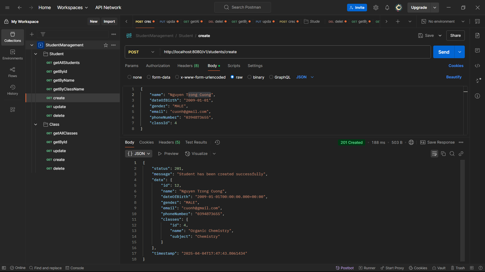
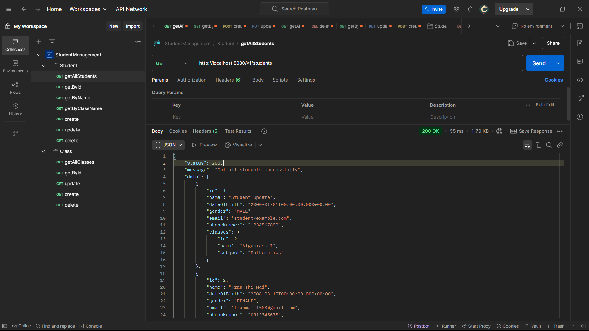
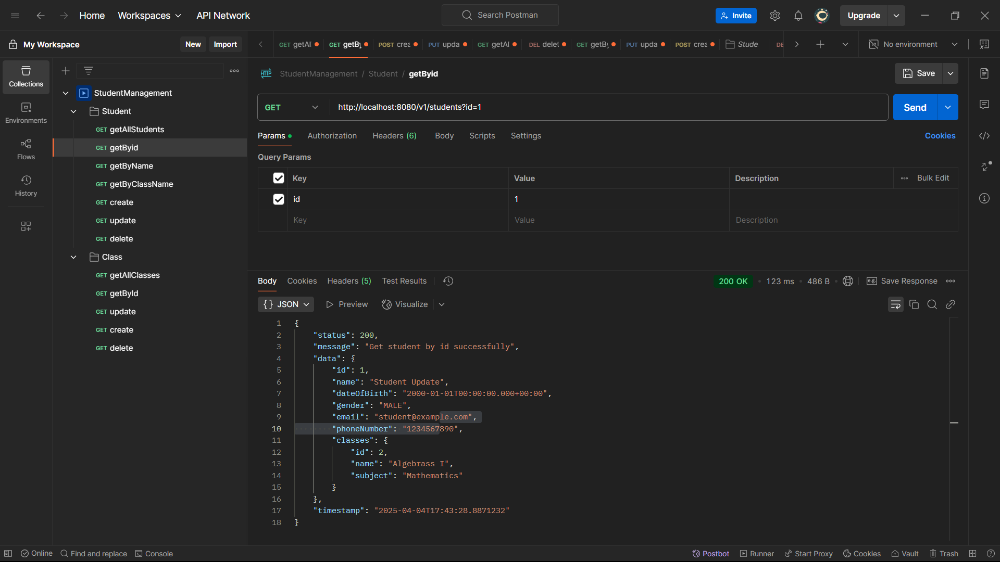
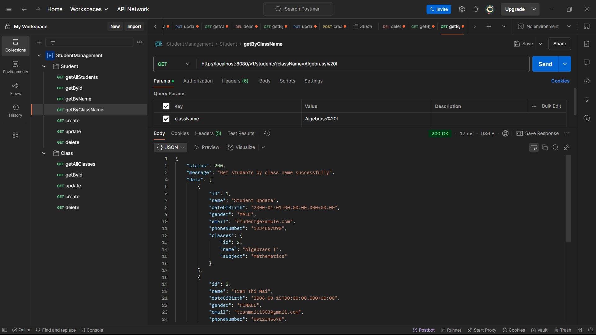
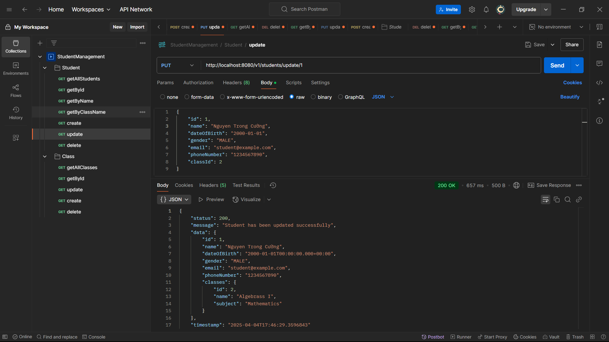
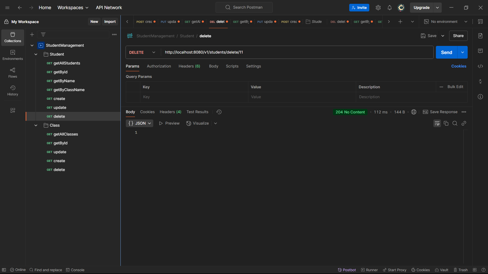

# Student-Class Management System   
## Description
This is a simple student-class management system that uses Spring Boot RESTful API for managing students and classes. 
It allows users to perform CRUD operations on students and classes, and find students by their name, their id or the class.
## Technologies Used
- Java 17
- Spring boot 3.4.4
- Spring Data JPA
- My SQL
- Lombok
- Mapstruct
- Jakarta Validation
## Project structure
```
btvn-buoi4/
├── src/
│   ├── main/
│   │   ├── java/org/example/btvnbuoi4/
│   │   │   ├── controllers        # REST API controllers
│   │   │   ├── dtos               # Data Transfer Objects
│   │   │   │   ├── requests       # Request data models
│   │   │   │   └── responses      # Response data models
│   │   │   ├── exceptions         # Exceptions and error handling
│   │   │   ├── mappers            # MapStruct mappers for DTO conversions
│   │   │   ├── models             # JPA entities
│   │   │   ├── repositories       # Spring Data JPA repositories
│   │   │   ├── services           # Business logic layer
│   │   │   │   └── impl           # Service implementations
│   │   │   └── BtnvBuoi4Application.java # Main Spring Boot application
│   │   └── resources/
│   │       ├── static.images      # Static images
│   │       └── application.properties # Application configuration
└── README.md                      # Project documentation
```

## Getting Started
### Prerequisites
- JDK 17+
- Maven
- MySQL server
- Postman or any other API testing tool
- IDE (IntelliJ IDEA, Eclipse, etc.)
### Setup and installation
1. Clone the repository ([Instruction](https://spiderum.com/bai-dang/Cach-clone-mot-du-an-tu-Github-ve-May-UplUsqANeKCp))
2. Configure MySQL database in [`application.properties`](src/main/resources/application.properties) file
3. Run the application using your IDE
## Testing the API

### Student API

#### Create a new student
- **Endpoint**: `POST http://localhost:8080/v1/students/create`
- **Request Body**: Student details
- **Response**: Created student with ID, status code **201 (Created)**



#### Get all students
- **Endpoint**: `GET http://localhost:8080/v1/students`
- **Response**: List of all students, status code **200 (OK)**



#### Get student by ID
- **Endpoint**: `GET http://localhost:8080/v1/students/?id={id}`
- **Response**: Student details, status code **200 (OK)**



#### Get students by class name
- **Endpoint**: GET http://localhost:8080/v1/students/className={classes}
- **Response**: Student details, status code **200 (OK)**




#### Update student
- **Endpoint**: `PUT http://localhost:8080/v1/students/update/{id}`
- **Request Body**: Updated student details
- **Response**: Updated student details, status code **200 (OK)**



#### Delete student
- **Endpoint**: `DELETE http://localhost:8080/v1/students/delete/{id}`
- **Response**: No response body, but status code **204 (No Content)**



### Class API: similar to Student API

    